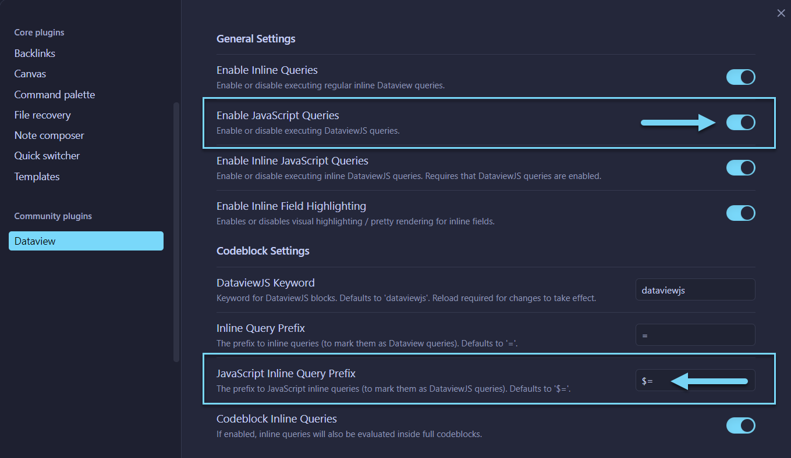

# 🌟 Obsidian Element Enhancer
_Add custom classes to Obsidian elements_

Allthough Obsidian is very customizable, it doesn't let you add css classes to _Markdown_ elements out fo the box.
For example, if I wanted to change the color or appearacne of a specific list of items I wouldn't be able to do it; I would be locked to changeing it for an entire page or vault by using a theme.

This simple script will allow us to apply custom css classes to any adjacent _Markwon_ element for styling to our heart's content.

## Instalation
1. Install the `Dataview` plugin and enable `JavaScript Queries`
  
2. copy the [+ scripts/obsidian-element-enhancer.js](./%2B%20scripts/obsidian-element-enhancer.js) file to your Obsidian vault (suggested to save it to a "./scripts" folder).

## Usage
1. 