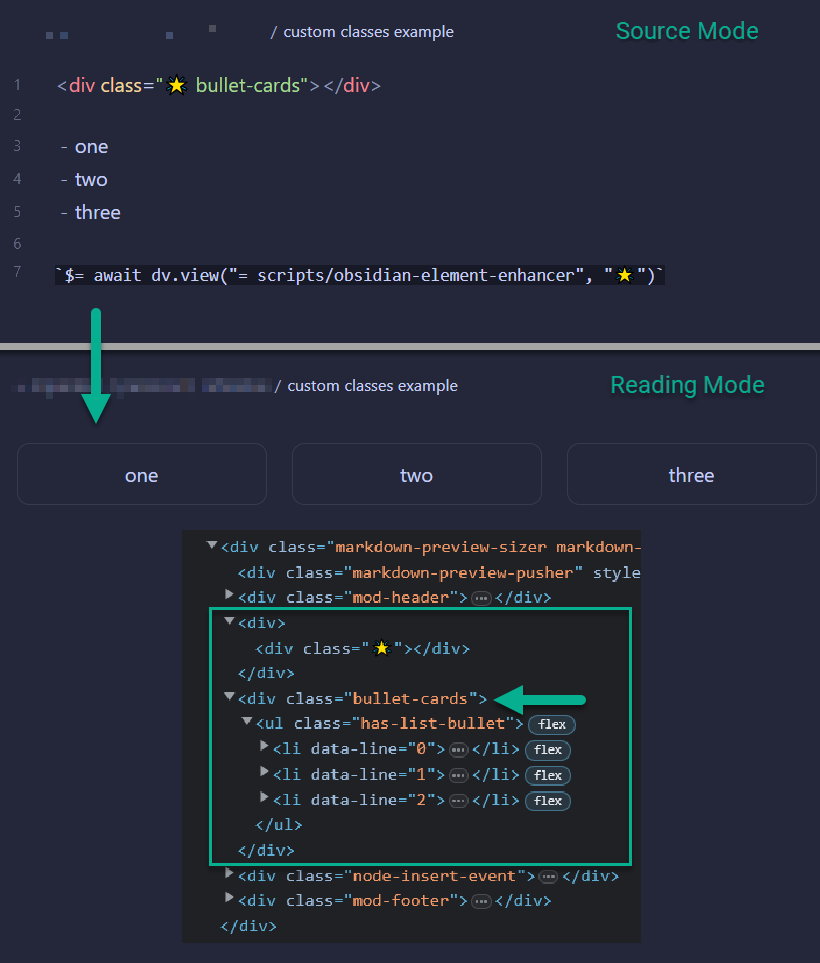

# 🌟 Obsidian Element Enhancer
_Add custom classes to Obsidian elements_ 🔨

Allthough Obsidian is very customizable, it doesn't allow for adding css classes to _Markdown_ elements out fo the box.
For example, if I wanted to change the color or appearacne of a specific list of items I wouldn't be able to do it; I would be locked to changeing it for an entire page or vault by using page level css or a theme.

**_Obsidian Element Enhancer_** implements a simple script that enables the ability to apply custom css classes to any adjacent _Markwon_ element for styling. 🎉

## Instalation
1. Install the `Dataview` plugin and enable `JavaScript Queries`
  
2. copy the [scripts/obsidian-element-enhancer.js](./scripts/obsidian-element-enhancer.js) file to your Obsidian vault (suggested to save it to a "./scripts" folder).

## Usage
1. Enter the following `div` on a new line before the _markdown_ element you want to add custom classes to (*note*: you must insert a blank line between the `div` and target _markdown_ element):

    ```html
    <div class="🌟 example1 example2 example3"></div>
    ```

2. Add the following as the last line in your note. Make sure to update the path to the script that you copied to your vault in the *Installation* step above.

    ```javascript
    `$= await dv.view("scripts/obsidian-element-enhancer", "🌟")`
    ```

<br>

---

<br>

## Example

  